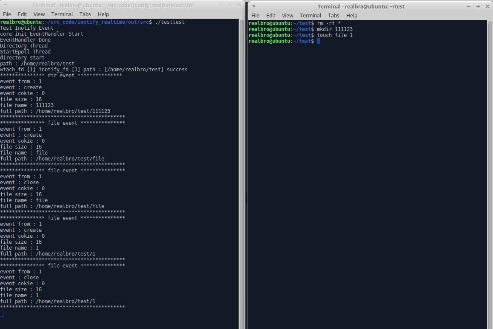

# inotify를 이용한 실시간 이벤트 탐지 
## Env
- ubuntu 16.04.06 LTS
- gcc 5

## Inotify Issue
- 몹시 불편하게도 inotify는 디렉토리에 대한 리커시브한 기능이 없음.
- Watch Count 사이즈 제한 있으며 default 사이즈가 매우작다 8142 정도 (inotify max event count를 sys명령어로 통제가능)
- fanotify 처럼 pid 가 날라오지 않아서 해당 파일의 예외처리 작업이 별도로 들어가야된다. (/proc/{pid}/fd 이쪽을 긁는게 가장 간단함)
- fd 정보가 없기때문에 파일 blocking 처리는 못할듯
- 이벤트 구조체 내부에 file name과 length만 날라오는데, full path를 얻기위해 add_watch가 된 list를 따로 유지가 필요하다. (move 이벤트가 오면 갱신이 필요, 들록된 내용은 유지가 되는듯함)

## Event 발생시 inotify_struct 정보
1. 구조체 내부 int cookies는 move 이벤트 발생시 쌍을 맞추기 위해 발생함 ( MOVE_FROM -> MOVE_TO 이벤트 순차적으로 발생)
2. 일반적으로 파일이 OverWrite 될 때나 파일이 생성될대 과정은 아래와 같다. 흐름을 통하여 제어하는편이 좋아보임 
 Remove (if file exist) -> Create -> Modify -> Close_write.  

## Fanotify가 inotify보다 좋은점.
1. event struct size가 일정함 (pid, fd, event (mask) 이런정보가 오기때문에 일정한구조체) inotify는 file len이 가변적이기때문에 size계산을 번거롭게 게속 해야됨.
2. 호출한 pid가 같이 오기때문에 어디서 긁었는지 바로 확인가능 inotify는 누가 긁었는지 모르기때문에 확인하려면 별도의 루틴을 따로 태워야됨
3. mount단위로 쉽게 적용가능하기대문에 코드 몇줄이면 루트 이하 전체 확인가능 (inotify는 디렉토리를 하나하나씩 걸어줘야됨)

## Result
- 아래의 이미지 처럼 원하는 경로의 이벤트를 처리 가능함.
- 가능하다면 inotify 보다는 fanotify를 쓰자.
- 개발하는 입장에서 inotify가 적은 api 호출로 간편하게 쓰기 좋은점이 있다.

